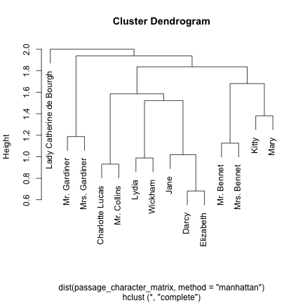

<!-- README.md is generated from README.Rmd. Please edit that file -->


fuzzyjoin: Join data frames on inexact matching
------------------

The fuzzyjoin package is a variation on dplyr's [join](http://www.inside-r.org/node/230646) operations that allows matching not just on values that match between columns, but on inexact matching. This includes:

* Numeric values that are within some distance (`difference_inner_join`)
* Strings that are similiar in Levenshtein/cosine/Jaccard distance, or [other metrics](http://finzi.psych.upenn.edu/library/st/html/st-metrics.html) from the [stringdist](https://cran.r-project.org/web/packages/stringdist/index.html) package (`stringdist_inner_join`)
* A regular expression in one column matching to another (`regex_inner_join`)

One relevant use case is for classifying freeform text data while allowing 

### Example of `stringdist_inner_join`: Correcting misspellings against a dictionary

Often you find yourself with a set of words that you want to combine with a dictionary.

The fuzzyjoin package comes with a set of common misspellings ([from Wikipedia](https://en.wikipedia.org/wiki/Wikipedia:Lists_of_common_misspellings/For_machines)):


```r
library(dplyr)
library(fuzzyjoin)
data(misspellings)

misspellings
#> Source: local data frame [4,508 x 2]
#> 
#>    misspelling    correct
#>          (chr)      (chr)
#> 1   abandonned  abandoned
#> 2    aberation aberration
#> 3     abilties  abilities
#> 4       abilty    ability
#> 5      abondon    abandon
#> 6       abbout      about
#> 7        abotu      about
#> 8       abouta    about a
#> 9      aboutit   about it
#> 10    aboutthe  about the
#> ..         ...        ...
```


```r
# use the dictionary of words from the qdapDictionaries package,
# which is based on the Nettalk corpus.
library(qdapDictionaries)
words <- tbl_df(DICTIONARY)

words
#> Source: local data frame [20,137 x 2]
#> 
#>     word syllables
#>    (chr)     (dbl)
#> 1     hm         1
#> 2    hmm         1
#> 3   hmmm         1
#> 4   hmph         1
#> 5  mmhmm         2
#> 6   mmhm         2
#> 7     mm         1
#> 8    mmm         1
#> 9   mmmm         1
#> 10   pff         1
#> ..   ...       ...
```

As an example, we'll pick 1000 of these words (you could try it on all of them though), and use `stringdist_inner_join` to join them against our dictionary.


```r
set.seed(2016)

joined <- misspellings %>%
  sample_n(1000) %>%
  stringdist_inner_join(words, by = c(misspelling = "word"), max_dist = 1)
```

By default, `stringdist_inner_join` uses optimal string alignment (Damerau–Levenshtein distance), and we're setting a maximum distance of 1 for a join. Notice that they've been joined in cases where `misspelling` is close to (but not equal to) `word`:


```r
joined
#> Source: local data frame [730 x 4]
#> 
#>    misspelling     correct        word syllables
#>          (chr)       (chr)       (chr)     (dbl)
#> 1  charasmatic charismatic charismatic         4
#> 2        sould      should       could         1
#> 3        sould      should      should         1
#> 4        sould      should        sold         1
#> 5        sould      should        soul         1
#> 6        sould      should       sound         1
#> 7        sould      should       would         1
#> 8        fiels       feels       field         1
#> 9        fiels       feels        fils         1
#> 10    conscent     consent     consent         2
#> ..         ...         ...         ...       ...
```

Note that there are some redundancies; words that could be multiple items in the dictionary. These end up with one row per "guess" in the output. How many words did we classify?


```r
joined %>%
  count(misspelling, correct)
#> Source: local data frame [457 x 3]
#> Groups: misspelling [?]
#> 
#>    misspelling      correct     n
#>          (chr)        (chr) (int)
#> 1    abritrary    arbitrary     1
#> 2    accademic     academic     1
#> 3    accension    ascension     2
#> 4   accessable   accessible     1
#> 5     accidant     accident     1
#> 6  accidentaly accidentally     1
#> 7    accordeon    accordion     1
#> 8       addopt        adopt     1
#> 9    addtional   additional     1
#> 10  admendment    amendment     1
#> ..         ...          ...   ...
```

So we found a match in the dictionary for about half of the misspellings. In how many of the ones we classified did we get at least one of our guesses right?


```r
which_correct <- joined %>%
  group_by(misspelling, correct) %>%
  summarize(guesses = n(), one_correct = any(correct == word))

ggplot(which_correct)
#> Error in eval(expr, envir, enclos): could not find function "ggplot"
which_correct
#> Source: local data frame [457 x 4]
#> Groups: misspelling [?]
#> 
#>    misspelling      correct guesses one_correct
#>          (chr)        (chr)   (int)       (lgl)
#> 1    abritrary    arbitrary       1        TRUE
#> 2    accademic     academic       1        TRUE
#> 3    accension    ascension       2        TRUE
#> 4   accessable   accessible       1        TRUE
#> 5     accidant     accident       1        TRUE
#> 6  accidentaly accidentally       1       FALSE
#> 7    accordeon    accordion       1        TRUE
#> 8       addopt        adopt       1        TRUE
#> 9    addtional   additional       1        TRUE
#> 10  admendment    amendment       1        TRUE
#> ..         ...          ...     ...         ...

# percentage of guesses getting at least one right
mean(which_correct$n)
#> Error: Unknown name

# number uniquely correct (out of the original 1000)
sum(which_correct$guesses == 1 & which_correct$one_correct)
#> [1] 296
```

Not bad. If we increase our distance threshold, we'll increase the fraction with a correct guess, but also get more false positive guesses.

You can try other distance thresholds, other dictionaries, and other distance metrics (see [stringdist-metrics] for more). This function is especially useful on a domain-specific dataset, such as free-form survey input that is likely to be close to one of a handful of responses.

### Example of `regex_inner_join`: Classifying text based on regular expressions

Consider the book Pride and Prejudice, by Jane Austen (retrieved from [Project Gutenberg](https://www.gutenberg.org/) and provided as an extra dataset in `extdata`). We could split the books up into "passages" of 50 lines each.


```r
library(dplyr)
library(stringr)

f <- system.file("extdata", "pride_and_prejudice.txt.zip", package = "fuzzyjoin")
lines <- readLines(unz(f, "pride_and_prejudice.txt"))

passages <- data_frame(text = lines) %>%
  group_by(passage = 1 + row_number() %/% 50) %>%
  summarize(text = paste(text, collapse = " "))

passages
#> Source: local data frame [268 x 2]
#> 
#>    passage
#>      (dbl)
#> 1        1
#> 2        2
#> 3        3
#> 4        4
#> 5        5
#> 6        6
#> 7        7
#> 8        8
#> 9        9
#> 10      10
#> ..     ...
#> Variables not shown: text (chr).
```

Suppose we wanted to divide the passages based on which character's name is mentioned in each. Character's names may differ in how they are presented, so we construct a regular expression for each and pair it with that character's name.


```r
characters <- readr::read_csv(
"character,character_regex
Elizabeth,Elizabeth
Darcy,Darcy
Mr. Bennet,Mr. Bennet
Mrs. Bennet,Mrs. Bennet
Jane,Jane
Mary,Mary
Lydia,Lydia
Kitty,Kitty
Wickham,Wickham
Mr. Collins,Collins
Lady Catherine de Bourgh,de Bourgh
Mr. Gardiner,Mr. Gardiner
Mrs. Gardiner,Mrs. Gardiner
Charlotte Lucas,(Charlotte|Lucas)
")
```

Notice that for each character, we've defined a regular expression (sometimes allowing ambiguity, sometimes not) for detecting their name. Suppose we want to "classify" passages based on whether this regex is present.

With fuzzyjoin's `regex_inner_join` function, we do:


```r
character_passages <- passages %>%
  regex_inner_join(characters, by = c(text = "character_regex"))
```

This combines the two data frames based on cases where the `passages$text` column is matched by the `characters$character_regex` column. (Note that the dataset with the text column must always come first). This results in:


```r
character_passages %>%
  select(passage, character, text)
#> Source: local data frame [1,122 x 3]
#> 
#>    passage       character
#>      (dbl)           (chr)
#> 1        1      Mr. Bennet
#> 2        2      Mr. Bennet
#> 3        2            Jane
#> 4        2           Lydia
#> 5        2 Charlotte Lucas
#> 6        3       Elizabeth
#> 7        3      Mr. Bennet
#> 8        3     Mrs. Bennet
#> 9        3           Kitty
#> 10       4      Mr. Bennet
#> ..     ...             ...
#> Variables not shown: text (chr).
```

This shows that Mr. Bennet's name appears in passages 1, 2, 4, and 6, while Charlotte Lucas's appears in 3. Notice that having fuzzy-joined the datasets, some passages will end up duplicated (those with multiple names in them), while it's possible others will be missing entirely (those without names).

We could ask which characters are mentioned in the most passages:


```r
character_passages %>%
  count(character, sort = TRUE)
#> Source: local data frame [14 x 2]
#> 
#>                   character     n
#>                       (chr) (int)
#> 1                 Elizabeth   229
#> 2                     Darcy   162
#> 3                      Jane   134
#> 4                   Wickham    89
#> 5               Mrs. Bennet    87
#> 6                     Lydia    79
#> 7               Mr. Collins    73
#> 8           Charlotte Lucas    68
#> 9                Mr. Bennet    51
#> 10                    Kitty    42
#> 11            Mrs. Gardiner    32
#> 12 Lady Catherine de Bourgh    27
#> 13             Mr. Gardiner    25
#> 14                     Mary    24
```

The data is also well suited to discover which characters appear in scenes together, and to cluster them to find groupings of characters (like in [this analysis]).


```r
passage_character_matrix <- character_passages %>%
  group_by(passage) %>%
  filter(n() > 1) %>%
  reshape2::acast(character ~ passage, fun.aggregate = length, fill = 0)

passage_character_matrix <- passage_character_matrix / rowSums(passage_character_matrix)

h <- hclust(dist(passage_character_matrix, method = "manhattan"))

plot(h)
```

 

Other options for further analysis of this fuzzy-joined dataset include doing sentiment analysis on text surrounding each character's name, [similar to Julia Silge's analysis here](http://juliasilge.com/blog/You-Must-Allow-Me/).

### Future Work

A few things I'd like to work on:

* **join operations besides inner**: I haven't implemented the `left_join`, `semi_join`, and `anti_join` equivalents. I see `left_join` as being especially important since you'll often also want to examine the words/passages/etc that *didn't* get matched.

* **Shortcuts on string distance matching**: If two strings are more than 1 character apart in length, the method is `osa`, and `max_dist` is 1, you don't even need to compare them.

* **More examples**: I've used this package in other powerful ways, but on proprietary data. I'm interested in ideas for use cases that can be provided as vignettes.
