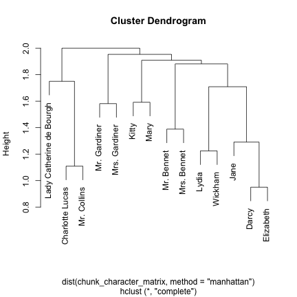

---
output:
  md_document:
    variant: markdown_github
---

<!-- README.md is generated from README.Rmd. Please edit that file -->


fuzzyjoin: Join data frames on inexact matching
------------------

The fuzzyjoin package is a variation on dplyr's [join](http://www.inside-r.org/node/230646) operations that allows matching not just on values that match between columns, but on inexact matching. This includes:

* Numeric values that are within some distance (`difference_join`)
* Strings that are similiar in Levenshtein/cosine/Jaccard distance, or [other metrics](http://finzi.psych.upenn.edu/library/stringdist/html/stringdist-metrics.html) from the [stringdist](https://cran.r-project.org/web/packages/stringdist/index.html) package (`stringdist_join`)
* A regular expression in one column matching to another (`regex_join`)

### Examples

Consider the book Pride and Prejudice, by Jane Austen (retrieved from Project Gutenberg and provided as an extra dataset). We could split the books up into "chunks" of 50 lines each.


```r
library(dplyr)
library(stringr)

library(fuzzyjoin)

f <- system.file("extdata", "pride_and_prejudice.txt.zip", package = "fuzzyjoin")
lines <- readLines(unz(f, "pride_and_prejudice.txt"))

chapters <- data_frame(text = lines) %>%
  group_by(chunk = 1 + row_number() %/% 50) %>%
  summarize(text = paste(text, collapse = " "))

chunks
#> Source: local data frame [536 x 2]
#> 
#>    chunk
#>    (dbl)
#> 1      1
#> 2      2
#> 3      3
#> 4      4
#> 5      5
#> 6      6
#> 7      7
#> 8      8
#> 9      9
#> 10    10
#> ..   ...
#> Variables not shown: text (chr).
```

Suppose we wanted to divide the chunks based on which character's name is mentioned in each.


```r
characters <- readr::read_csv(
"character,character_regex
Elizabeth,Elizabeth
Darcy,Darcy
Mr. Bennet,Mr. Bennet
Mrs. Bennet,Mrs. Bennet
Jane,Jane
Mary,Mary
Lydia,Lydia
Kitty,Kitty
Wickham,Wickham
Mr. Collins,Collins
Lady Catherine de Bourgh,de Bourgh
Mr. Gardiner,Mr. Gardiner
Mrs. Gardiner,Mrs. Gardiner
Charlotte Lucas,(Charlotte|Lucas)
")
```


```r
character_chunks <- chunks %>%
  regex_join(characters, by = c(text = "character_regex"))
```

This combines the two data frames based on cases where the `chunks$text` column is matched by the `characters$character_regex` column, resulting in:


```r
character_chunks %>%
  select(chunk, character, text)
#> Source: local data frame [1,578 x 3]
#> 
#>    chunk       character
#>    (dbl)           (chr)
#> 1      1      Mr. Bennet
#> 2      2      Mr. Bennet
#> 3      3 Charlotte Lucas
#> 4      4      Mr. Bennet
#> 5      4            Jane
#> 6      4           Lydia
#> 7      5      Mr. Bennet
#> 8      6       Elizabeth
#> 9      6      Mr. Bennet
#> 10     6     Mrs. Bennet
#> ..   ...             ...
#> Variables not shown: text (chr).
```

This shows that Mr. Bennet's name appears in chunks 1, 2, 4, and 6, while Charlotte Lucas's appears in 3. Notice that having fuzzy-joined the datasets, some chunks will end up duplicated, while it's possibly others will be missing entirely.

We could ask which characters are mentioned in the most chunks:


```r
character_chunks %>%
  count(character, sort = TRUE)
#> Source: local data frame [14 x 2]
#> 
#>                   character     n
#>                       (chr) (int)
#> 1                 Elizabeth   364
#> 2                     Darcy   240
#> 3                      Jane   188
#> 4                   Wickham   121
#> 5               Mr. Collins   112
#> 6               Mrs. Bennet   111
#> 7                     Lydia   107
#> 8           Charlotte Lucas    90
#> 9                Mr. Bennet    65
#> 10                    Kitty    49
#> 11            Mrs. Gardiner    43
#> 12 Lady Catherine de Bourgh    32
#> 13             Mr. Gardiner    29
#> 14                     Mary    27
```

The data is also well suited to discover which characters appear in scenes together, and to cluster them based on this:


```r
chunk_character_matrix <- character_chunks %>%
  group_by(chunk) %>%
  filter(n() > 1) %>%
  reshape2::acast(character ~ chunk, fun.aggregate = length, fill = 0)

chunk_character_matrix <- chunk_character_matrix / rowSums(chunk_character_matrix)

h <- hclust(dist(chunk_character_matrix, method = "manhattan"))

plot(h)
```

 

Other options would include doing sentiment analysis on text surrounding each character's name, [similar to Julia Silge's analysis here](http://juliasilge.com/blog/You-Must-Allow-Me/).
